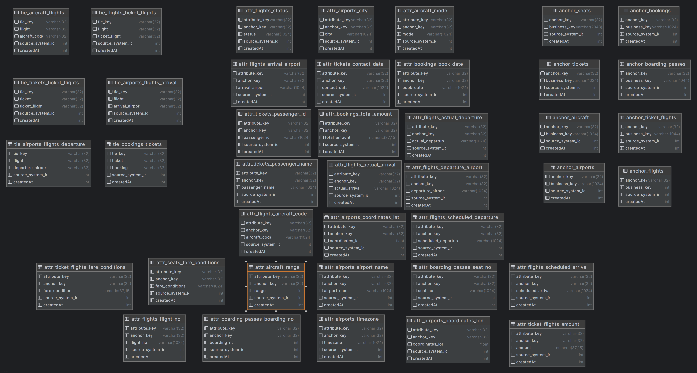

# dwh-hw2 komarov

Я почти успел до 75%, я после этого дд только `README.md`
и диаграмму загрузил, честно (в коммитах видно)

Но зато я норм распишу, я пытался, пощадите, плз.

Я очень хотел, чтобы все собиралось одной командой, но
у меня уже не хватает терпение, да и времени тоже.

Надеюсь, в след. дз я добью это.

В таблицах и в хранилище в целом присутствует некая нелогичность, 
но я все делал так, чтобы соответствовать схеме из pdf.

Контейнеры:
- `postgres_master` - мастер-база
- `postgres_slave` - ее реплика (в `docker-compose` закомментил, 
чтоб не мешалась, в задании она не участвует)
- `vertica-dwh` - потребует логин, сам собрал образ и запушил в dockerhub, 
чтоб она не инитилась тестовой базой, положил `Dockerfile`, на случай, 
если что-то не так пойдет
- `zookeeper`, `broker`, `debezium`,`debezium-ui`,`schema-registry`, `rest-proxy` -
тут все понятно, поднимаем кафку, цепляем дебезиум, пришиваем апишку и рест.
- `connector` - debian контейнер, пробрасывает sink-коннекторы для kafka
  (как на запись, так и на чтение).
- `./vertica-plugin` - confluentinc-коннектор для vertica, маунчу в debezium
- `./connectors` - прописанные конфиги для коннекторов, маунтятся в connector,
там отправляются curl'ом в debezium
- `./models` - пропиcанные dbt-модели
- `dbt_project.yml` - это для dbt базовый конфиг
- `init-postgres.sql` - проливает postgres мастер-базу
- `profiles.yml` - конфиг для подключения dbt к vertica

Собираем все командой
```shell
docker-compose up -d
```
(если нужна реплика, сначала надо `sh docker-init.sh`, потом оставшиеся подтянуть)

Как все запустится, прописываем
```shell
dbt run
```
И в vertica прольются по якорной модели таблички.
Выбрал именно vertica + якорь, потому услышал на паре, что это удачное сочетание +
хотелось поиграться с vertica (было больно).

Настроить автопролив dbt у меня не удалось, я так и не понял, умеет он так или нет.

Я понимаю, что я мог замутить что-то типа:

```python
from airflow import DAG
from airflow.operators.bash import BashOperator
from datetime import datetime, timedelta

default_args = {
    'owner': 'airflow',
    'depends_on_past': False,
    'start_date': datetime(2024, 2, 23),
    'retries': 1,
    'retry_delay': timedelta(minutes=5),
}

dag = DAG(
    'dbt_run',
    default_args=default_args,
    schedule_interval='@hourly',
    catchup=False
)

run_dbt = BashOperator(
    task_id='run_dbt',
    bash_command='dbt run',
    dag=dag
)

run_dbt
```

и вроде было бы норм, но с AirFlow я поиграюсь в следующих домашках, а щас
я выдохся.

В таблички в vertica данные шустро приезжают, а вот dbt у меня только ручками,
вот это печально.

Мощнейшее дз, хз, че еще писать, вроде все, диаграмма вот, собственно, из-за
нее и не успел чуть-чуть:




#### Источники вдохновения:
- https://habr.com/ru/companies/avito/articles/322510/
- https://www.anchormodeling.com/tutorials/
- https://habr.com/ru/companies/sberbank/articles/414895/
- https://ivan-shamaev.ru/dbt-clickhouse-tutorial-run-model-data/
- https://docs.getdbt.com
- https://debezium.io/documentation


# dwh-hw3 komarov

По традиции, дописываю ридми после дедлайна, коммит с кодом вовремя.

Добавились стандартные контейнеры с `af`, повыкидывал лишнее + веб-сервер на порту `8084`, 
потому что на `8080` у меня `debezium`.

Все поднимается одним вызовом ```docker-compose up -d``` из корня каталога.

В папке `./dags` у меня лежит три дага, один раскладывает данные по якорю каждые 5 минут, второй и 
третий собирают витрины. 

Не надо меня ругать за `sleep 30` и `|| true` в дагах. Первая проблема из-за того, что я не смог 
настроить нормальный хелфчек для вертики (не хотелось тратить время, которого не было), ну и для того,
чтобы даг-раскладыватель якорей успевал отработать раньше витрин при первом запуске. 
Вторая же проблема в том, что при корректной работе `dbt` возвращает исходный код 1, а `af` думает, что
это ошибка, так и не нашел в интернете норм способов это поправить.

Я тестил это 200 раз и так и так, и все корректно отрабатывало, поэтому, если что-то упало,
то все поправлю или скажу, почему падает, реально, не хочу снижения баллов за
какую-то фигню, слишком много сил потрачено. Всякие костыли есть, я готов над ними покумекать и посидеть,
но если мне предоставят время. 

Также запрашиваю возможность сдать 4-е дз после дедлайна курса, я думаю, там все быстро смогу замутить,
вроде задание не сложное, очень хочется норм оценку за курс.